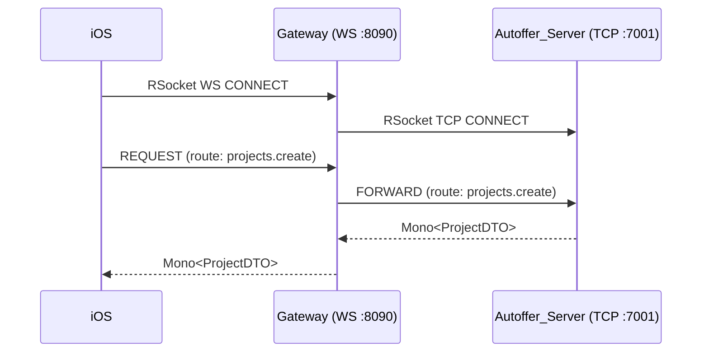

# Autoffer Platform — Server & Microservices

Autoffer is a **reactive, cloud-native platform** that digitizes BOQ parsing, quoting, and real-time collaboration for the aluminum construction industry. It shortens quoting from **hours/days** to **minutes/seconds** via automated document parsing (DocAI), project lifecycle management, and an RSocket-based chat and workflow engine.

> **Repo layout note:** the core backend folder is named **`Autoffer_Server`** (formerly `messaging-server`).

---

## 🧭 System Map (High-Level)

```mermaid
graph LR
  A[Android / Web Clients] -- RSocket (TCP:7001) --> S[Autoffer_Server (Spring Boot, Kotlin)]
  I[iOS Client] -- RSocket (WebSocket:8090) --> G[Gateway (Spring Boot, Kotlin)]
  G -- RSocket (TCP:7001) --> S
  S -- Reactive Repos --> M[(MongoDB Atlas)]
  S -- HTTP (5051) --> D[DocAI (FastAPI, Python) <br/> + GCP Document AI]
  subgraph Sidecars
    W[Window-Measurement (Kotlin) <br/> HTTP:8001 /health]
  end
  S -.-> W
```

- **Autoffer_Server** — Core service: projects, chat, users, ads, BOQ/Quote PDFs.
- **Gateway** — Bridges iOS (WebSocket) ⇄ server (TCP) for `rsocket-swift` compatibility.
- **DocAI (FastAPI)** — Parses BOQ PDFs via Google Document AI and returns structured JSON.
- **Window-Measurement** — Support microservice for measurements (HTTP/JSON, `/health`).

---

## ⚙️ Technologies

- **Kotlin + Spring Boot 3.2.x** with **WebFlux** (reactive).
- **RSocket** (TCP & WebSocket), payloads as **JSON**.
- **Mono** (single async value) & **Flux** (stream) — Project Reactor types.
- **MongoDB Atlas** (reactive repositories).
- **Python FastAPI** for **DocAI** microservice; integrates with **GCP Document AI**.
- **PDF generation** for BOQ & Quote (server-side).
- **GCP Cloud Run** + **Artifact Registry** for deployments (Docker images).

---

## 🔌 Network & Ports (dev)

- **Autoffer_Server**: HTTP **:8080**, RSocket TCP **:7001**  
- **Gateway**: RSocket over WebSocket **:8090** (`ws://…/rsocket`)  
- **DocAI (FastAPI)**: HTTP **:5051**  
- **Window-Measurement**: HTTP **:8001** (`/health`)  

---

## 🗃️ Data Models (DTOs)

### Project Creation

**Kotlin (server)**
```kotlin
package org.autoffer.models

data class CreateProjectRequest(
    val clientId: String,
    val projectAddress: String,
    val items: List<ItemModelDTO>,
    val factoryIds: List<String>
)
```

**Swift (iOS client)**
```swift
public struct CreateProjectRequest: Codable, Hashable {
    public var clientId: String
    public var projectAddress: String
    public var items: [ItemModelDTO]
    public var factoryIds: [String]
}
```

---

### AutoQuoteFromPdfRequest

```kotlin
package org.autoffer.models

data class AutoQuoteFromPdfRequest(
    val projectId: String,
    val factoryId: String,
    val factor: Double? = null,
    val includeRaw: Boolean? = null,
    val skipUnparseable: Boolean? = null,
    val filename: String? = "boq.pdf",
    val pdfBytes: ByteArray // ↳ serialized as Base64 in JSON over RSocket
)
```

---

### Quote Status Update

```kotlin
package org.autoffer.models

data class UpdateFactoryStatusRequest(
    val projectId: String,
    val factoryId: String,
    val newStatus: QuoteStatus
)

enum class QuoteStatus { PENDING, RECEIVED, ACCEPTED, REJECTED }
```

---

## 🚀 Dev Runbook

```bash
# Start all dev services (Autoffer_Server:8080, RSocket:7001; Gateway:8090; DocAI:5051)
bash scripts/start-dev.sh

# Stop all
bash scripts/stop-dev.sh

# If 8080 is occupied
lsof -i :8080
kill -9 <PID>
```

---

## 🔄 RSocket Endpoints (Server)

### Ping — Request/Response (Mono)

**Server**
```kotlin
import org.springframework.messaging.handler.annotation.MessageMapping
import reactor.core.publisher.Mono

@MessageMapping("ping")
fun ping(): Mono<String> =
    Mono.just("pong from Autoffer_Server")
```

**CLI Client**
```bash
rsc --request --route=ping --data "{}" tcp://localhost:7001
```

---

### Create Project — Request/Response (Mono)

**Server**
```kotlin
@MessageMapping("projects.create")
fun createProject(req: CreateProjectRequest): Mono<ProjectDTO> =
    projectService.create(req) // reactive: returns Mono<ProjectDTO>
```

**Sample Request Payload**
```json
{
  "clientId": "cust-001",
  "projectAddress": "123 Main St",
  "items": [
    { "profileId": "5500", "glassType": "Triplex", "width": 200, "height": 150, "quantity": 2 }
  ],
  "factoryIds": ["fact-001", "fact-002"]
}
```

---

### Chat Stream — Request/Stream (Flux)

**Server**
```kotlin
@MessageMapping("chat.stream")
fun chatStream(chatId: String): Flux<MessageDTO> =
    messageService.stream(chatId) // reactive stream of messages
```

**Android Client (example)**
```java
rsocketClient.requestStream(DefaultPayload.create("{\"chatId\":\"123\"}"))
    .map(p -> mapper.readValue(p.getDataUtf8(), MessageDTO.class))
    .doOnNext(adapter::addMessage)
    .subscribe();
```

---

### Send File in Chat — Request/Response (Mono)

**Server**
```kotlin
@MessageMapping("chat.sendfile")
fun sendFile(req: FileMessageRequest): Mono<MessageDTO> =
    chatService.sendFileMessage(req)
```

**Sample Request**
```json
{
  "chatId": "123",
  "senderId": "user-1",
  "receiverId": "factory-1",
  "filename": "boq.pdf",
  "fileBytes": "BASE64_STRING"
}
```

---

### Auto Quote (DocAI) — Request/Response (Mono)

**Server Route**
```kotlin
@MessageMapping("projects.autoQuote.parse")
fun autoQuote(req: AutoQuoteFromPdfRequest): Mono<QuoteModelDTO> =
    docAiClient.parseBoq(req) // makes HTTP call to FastAPI
```

**FastAPI (DocAI) sketch**
```python
from fastapi import FastAPI
from pydantic import BaseModel

app = FastAPI()

class AutoQuoteRequest(BaseModel):
    projectId: str
    factoryId: str
    factor: float | None = None
    filename: str | None = "boq.pdf"
    pdfBytes: bytes

@app.post("/parse")
async def parse_boq(req: AutoQuoteRequest):
    # call Google Document AI, transform to structured items
    items = await parse_with_gcp(req.pdfBytes)
    return {"factoryId": req.factoryId, "projectId": req.projectId, "items": items}
```

---

## 📄 PDF Generation

- **BOQ PDF** (auto-generated on project creation):
  - RTL tables (index on left), width/height columns split, creation date, pagination.
- **Quote PDF** (factory-branded):
  - Factory logo (from MongoDB), items with prices, Subtotal/VAT/Total.
  - Default notes (1–9), signature blocks (Factory & Customer).

---

## 🔐 iOS Gateway

- iOS connects using **RSocket over WebSocket** to `ws://localhost:8090/rsocket`.
- Gateway bridges to Autoffer_Server via **RSocket TCP** (`tcp://localhost:7001`).
- Purpose: ensure stability/compatibility with `rsocket-swift`.



---

## 🗄️ Persistence (MongoDB Atlas)

- Reactive repositories; project docs include references to:
  - `factoryIds: List<String>`
  - `quoteStatuses: Map<factoryId, QuoteStatus>`
  - `boqPdf` embedded (and quotes mapped by factoryId, planned/partial)

---

## 🚢 Deployment (GCP Cloud Run)

```bash
# Build & push image
docker build -t europe-west1-docker.pkg.dev/<PROJECT_ID>/autoffer/autoffer-server:latest ./Autoffer_Server
docker push europe-west1-docker.pkg.dev/<PROJECT_ID>/autoffer/autoffer-server:latest

# Deploy
gcloud run deploy autoffer-server \
  --image europe-west1-docker.pkg.dev/<PROJECT_ID>/autoffer/autoffer-server:latest \
  --region europe-west1 \
  --platform managed
```

- Configure Gateway & DocAI similarly (separate services, images, and Cloud Run services).

---

## 📈 Impact (Benchmarks)

- Legacy desktop: **2–5 min per item**, **~1 hour per 13-item BOQ**.
- Autoffer:
  - Manual entry with smart suggestions: **~15 sec per item**.
  - DocAI parsing: **~1 sec per page**.

---

## 🔧 Configuration

Below is a **ready-to-copy** `application-dev.yml` with all the key ports and service URLs used in development.
Adjust credentials, hosts, and regions as needed.

```yaml
# application-dev.yml
server:
  port: 8080

spring:
  application:
    name: Autoffer_Server
  data:
    mongodb:
      # Replace with your Mongo Atlas URI / DB name
      uri: mongodb+srv://<USER>:<PASSWORD>@cluster0.mongodb.net/autoffer?retryWrites=true&w=majority
  rsocket:
    server:
      transport: tcp
      port: 7001

# Logging
logging:
  level:
    root: INFO
    org.springframework.rsocket: DEBUG

# iOS Gateway (RSocket over WebSocket)
gateway:
  ws:
    port: 8090    # iOS connects to ws://localhost:8090/rsocket

# DocAI microservice (Python FastAPI)
docai:
  url: http://localhost:5051/parse

# Window-Measurement microservice (Kotlin)
measurement:
  healthUrl: http://localhost:8001/health
```

> Tip: If you keep the Gateway as a separate service, it should have its own Spring Boot config (e.g., `application.yml`) with `server.port: 8090` and the RSocket bridge target (TCP :7001).

### Example: Minimal Gateway `application.yml`

```yaml
server:
  port: 8090

autoffer:
  rsocket:
    server:
      # Where the gateway forwards to (Autoffer_Server RSocket TCP)
      host: localhost
      port: 7001
```

### Example: DocAI (FastAPI) dev run

```bash
# .venv is recommended; host on 5051 to match server config
uvicorn app:app --host 0.0.0.0 --port 5051 --reload
```

### Example: Ports quick-check

```bash
# Check who occupies a port (macOS)
lsof -i :8080
lsof -i :8090
lsof -i :7001
lsof -i :5051
lsof -i :8001
```

### Environment Variables (optional)

```bash
export SPRING_PROFILES_ACTIVE=dev
export MONGODB_URI="mongodb+srv://<USER>:<PASSWORD>@cluster0.mongodb.net/autoffer"
export DOCAI_URL="http://localhost:5051/parse"
```

---

## 👥 Team

- **Roei Hakmon** — Project Lead & Developer  
- **Yoram Rosenvaks** — Supervisor  
- Team: Daniel Levitsky · Netanel Neizov · Yuval Hofman

---

## 📜 License

Proprietary © Autoffer. All rights reserved.
